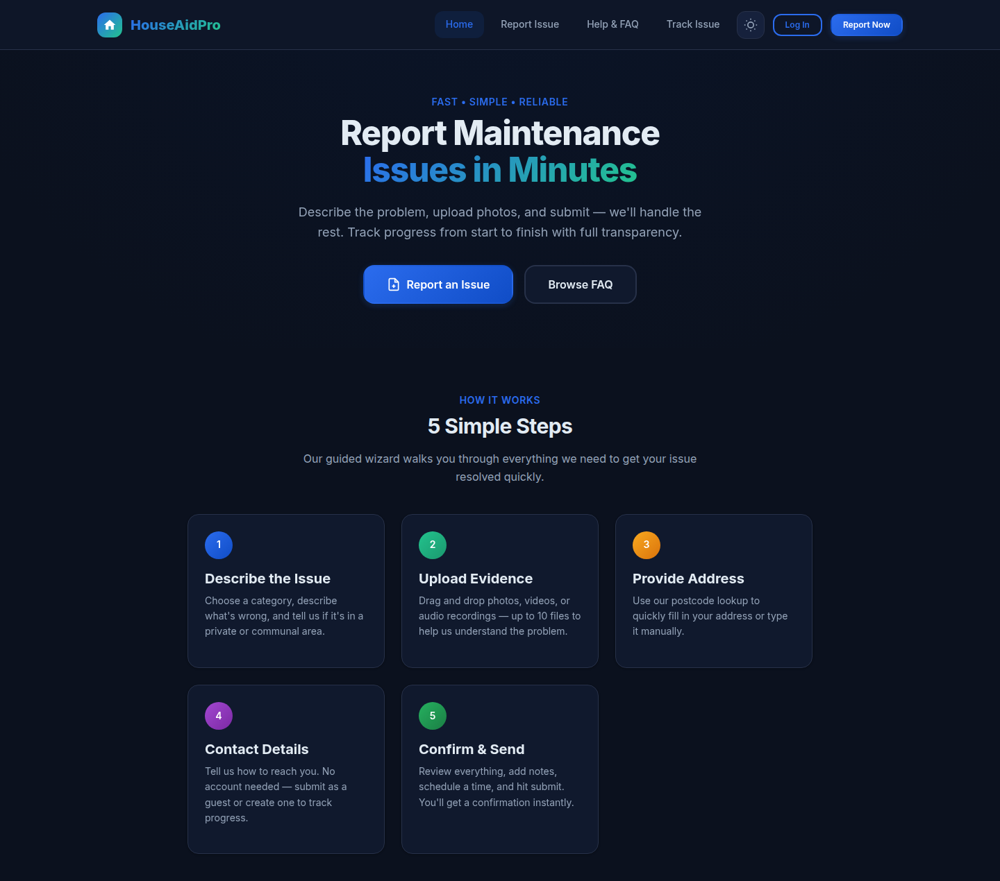
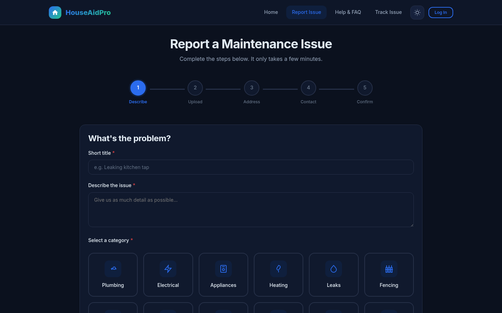
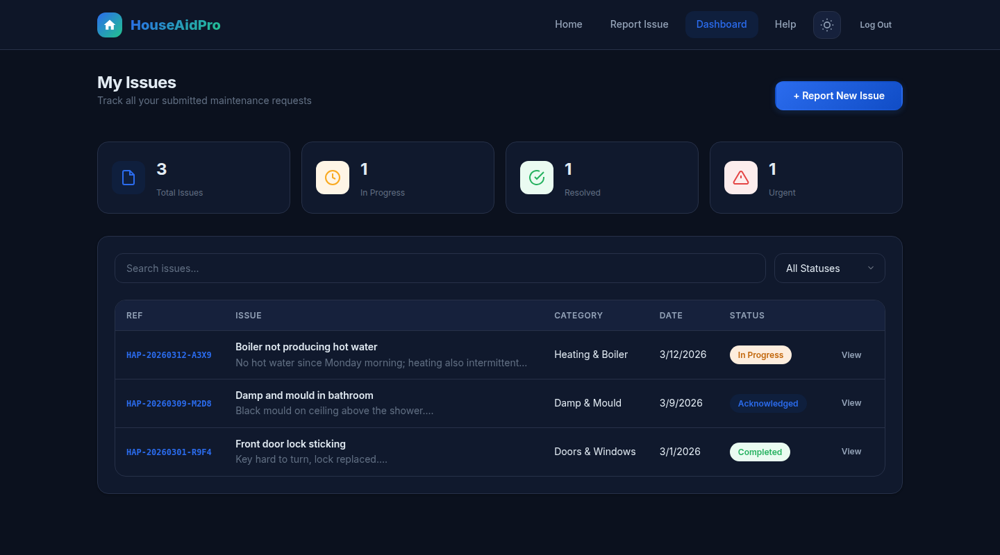
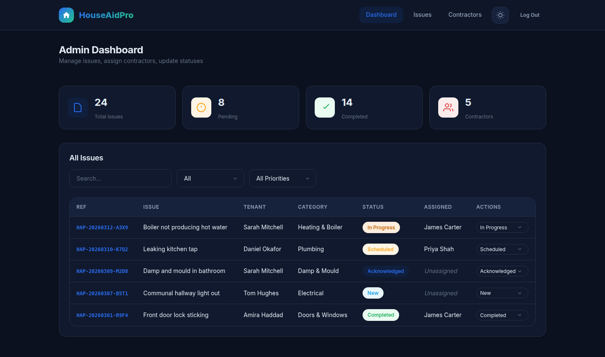
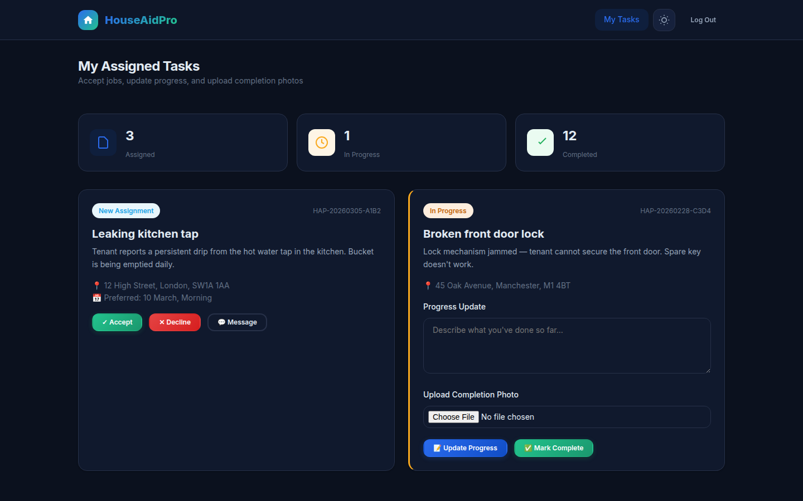

# HouseAidPro – Maintenance Reporting Web App

A full-stack PHP/MySQL web app for reporting and tracking property maintenance issues, with separate dashboards for tenants, admins and contractors.


[](https://github.com/vasea20101/houseaidpro-maintenance/actions/workflows/php-ci.yml)

## Screenshots

| Home | Report wizard |
|------|---------------|
|  |  |

| Tenant dashboard | Admin dashboard |
|------------------|-----------------|
|  |  |

| Contractor portal |
|-------------------|
|  |

<sub>Screenshots use sample data.</sub>

## Features

- **Issue reporting wizard** – step-by-step form with UK postcode lookup ([postcodes.io](https://postcodes.io)), priority (low → emergency), private/communal area, and photo/video/audio uploads.
- **Guest or account reporting** – report as a guest or register; every issue gets a reference code (e.g. `HAP-20260305-A3X9`).
- **Issue tracking** – look up an issue's status by its reference code.
- **Role-based dashboards**
  - *Tenant* – view your own issues and their status.
  - *Admin* – view all issues and update their status (new → acknowledged → scheduled → in progress → completed → closed).
  - *Contractor* – job portal UI (accept, progress updates, completion photo); the accept/complete API endpoints are built, wiring them into the page is next.
- **JSON API endpoints** – `auth`, `issues`, `contractors`, `notifications`, `submit_issue`, `upload_media`.
- **In-app notifications** – stored in the database and written to `logs/notifications.log` (email/SMS sending is not implemented yet).
- **Installable PWA basics** – web app manifest and a service worker that caches static assets.
- **CI** – GitHub Actions runs a PHP syntax check (`php -l`) on every push and pull request to `main`.

## Security

- Passwords hashed with bcrypt (`password_hash` / `password_verify`); session ID regenerated on login.
- All database queries use PDO prepared statements.
- API endpoints check the user's role (admin / contractor / issue owner) and return `401` / `403` otherwise.
- Uploads: file type detected server-side from the file contents (`finfo`), only an allow-list of image/video/audio types is accepted, files are renamed to random names, and `uploads/.htaccess` blocks script execution.
- Real credentials live in `includes/config.php`, which is git-ignored; only `config.example.php` is committed.
- Set `APP_DEBUG` to `false` in production so errors go to `logs/php-errors.log` instead of the browser.

## Tech Stack

| Layer    | Technology                               |
|----------|------------------------------------------|
| Backend  | PHP 8 (no framework), PDO                |
| Database | MySQL / MariaDB                          |
| Frontend | HTML, CSS, vanilla JavaScript            |
| Tooling  | Git, GitHub Actions, Laragon (local dev) |

## Project Structure

```
api/          JSON endpoints (auth, issues, contractors, notifications, uploads)
includes/     Shared PHP: config, DB connection, auth, helpers
pages/        Views: login, register, report, track, dashboard, admin, contractor, FAQ
js/           Frontend scripts (wizard, uploads, validation, postcode lookup, dashboard)
css/          Stylesheets
database/     schema.sql – creates the database, tables and seed data
uploads/      Uploaded media (runtime, git-ignored)
logs/         Application logs (runtime, git-ignored)
```

## Getting Started

1. Clone the repo into your web root as `maintenance` (the app expects to be served at `/maintenance`):
   ```bash
   git clone https://github.com/vasea20101/houseaidpro-maintenance.git maintenance
   ```
2. Create the database (the script creates the `houseaidpro` database itself):
   ```bash
   mysql -u root -p < maintenance/database/schema.sql
   ```
3. Create your config and set your database credentials:
   ```bash
   cp maintenance/includes/config.example.php maintenance/includes/config.php
   ```
4. Open `http://localhost/maintenance` (Laragon, XAMPP, WAMP or Apache).

The schema seeds an admin account (`admin@houseaidpro.com`). Change its password after the first login.

## Development Workflow

- Feature branches: `git checkout -b feature/<name>`
- Small, focused commits
- CI must pass before merging to `main`
- Secrets and runtime files stay out of version control (`.gitignore`)
